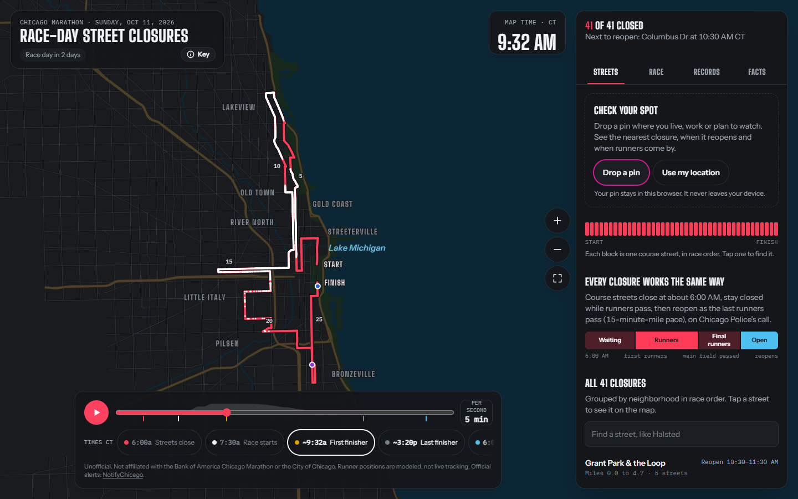
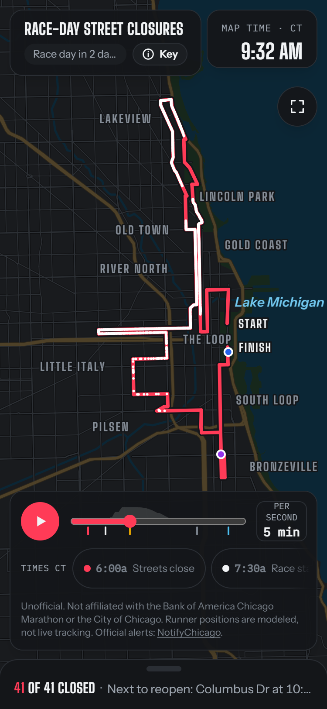
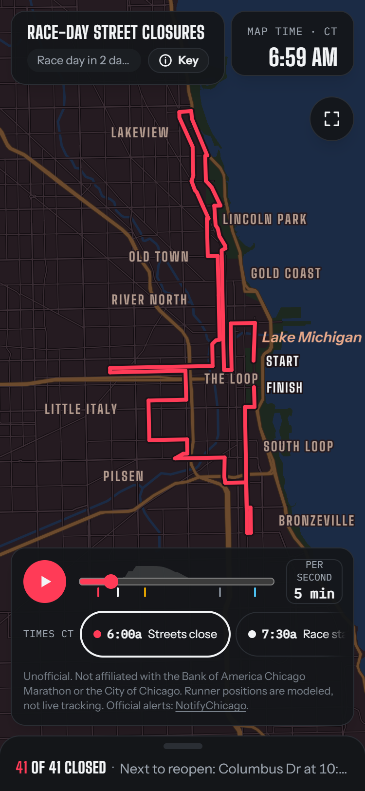
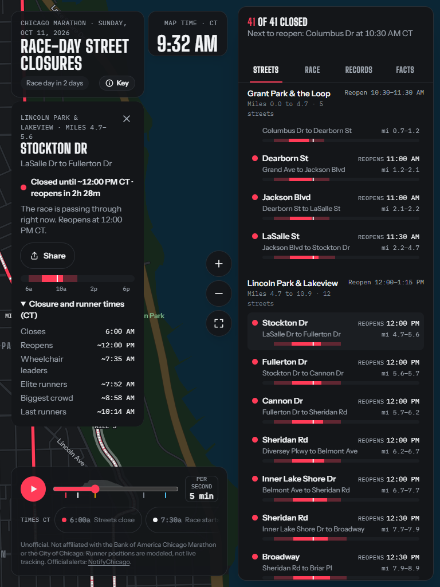

# Chicago Marathon Closure Map

Every street the 2026 Chicago Marathon closes, on one map, with when it opens back up.

**[lab.elijahos.com/chicago-marathon-map](https://lab.elijahos.com/chicago-marathon-map)**



## What's going on?

The marathon publishes its road closures as a flyer: 41 rows of street names, cross streets and
reopening times. It's accurate, and you can't picture any of it. One showed up in my elevator, I
couldn't tell whether my own street was closed, so I turned the flyer into a map.

Drop a pin and it tells you the nearest closure, when it reopens and when the runners come through.
Or scrub through race day: closures go red, the field works its way through the city, and streets
turn blue as they reopen.

It's unofficial, and runner positions are modeled, not tracked. For official alerts, use
[NotifyChicago](https://www.notifychicago.org/).

| Phone, mid-race | Phone, sunrise | Tablet, street card |
| --- | --- | --- |
|  |  |  |

## How it's built

Next.js 16 (App Router, prerendered), MapLibre GL JS 6 and a custom WebGL layer, all TypeScript.
The decisions that mattered:

**The page works before the map does.** The closure table and an SVG of the course are static HTML,
so the page is readable before any JavaScript runs. MapLibre loads after first paint. Without WebGL2
you get the SVG course; without JavaScript you still get the table.

**No third-party requests.** No tile server, no font CDN, no analytics. Streets, the lake, parks and
labels are local GeoJSON built from City of Chicago data. Fonts and MapLibre's worker are
self-hosted, and the Content-Security-Policy only allows this origin.

**A 55,000-person field in one draw call.** The field is a seeded model of the wave schedule and
finish-time distribution, so everyone sees the same race. Positions are computed each frame from the
race clock and drawn as up to 5,300 dots (one per ten runners) by a single custom WebGL layer, with
the leaders on top.

**Performance has a budget, and tests enforce it.** JavaScript before the map engine stays under
150 KB gzipped, checked in CI. On a real GPU, the perf suite holds at least 50 fps on an iPhone 13
profile with a 4x CPU slowdown, 60 fps on desktop, no long task over 100 ms, layout shift under 0.02
and LCP under 2.5 s on Fast 4G. If a device still can't keep up, a frame-time governor steps down the
runner count (5,300, 2,650, 1,325) and the pixel ratio.

**The light follows the clock.** The palette moves from night through sunrise (6:59 AM) to sunset
(6:16 PM), mixed in OKLCH. The course's red and blue never change, and a test holds them at 3:1
contrast or better against the land at every minute of the day.

**Every number has a source.** Closure times come from the organizer's street-closure notice. Every
fact in the app cites one of 31 sources in [`src/content/sources.ts`](src/content/sources.ts), and
anything modeled is marked with a ~.

**Accessible by default.** axe runs against every major state in the browser tests, along with
checks for visible focus, reduced motion and reflow down to 320 px.

## Where things live

```
src/content/   sourced copy and data: closures, events, waves, records, facts
src/model/     pure logic: race clock, seeded runner model, closure state, nearest closure, sun times
src/map/       MapLibre style, the runner layer, light through the day, the SVG fallback
src/quality/   device tiers and the frame-time governor
src/ui/        header, timeline, panel and phone sheet, tabs, street card, story
public/data/   map layers MapLibre fetches at runtime (generated by npm run build:data)
```

The model has no DOM or browser dependencies, so most of the logic is covered by fast unit tests.
The browser tests cover behavior, accessibility and the bundle budget.

## Running it

```
npm ci
npm run dev          # http://localhost:3000/chicago-marathon-map
npm test             # unit tests (Vitest)
npm run test:e2e     # browser tests (Playwright): behavior, accessibility, the 150 KB budget
npm run test:perf    # frame rate, LCP, long tasks and layout shift (needs a real GPU)
npm run build:data   # regenerate the map data from data/source
```

The app is served under `/chicago-marathon-map` because it sits behind the router on
lab.elijahos.com. CI runs lint, typecheck, unit and browser tests on every push.

## Data and credits

- Closures and reopening times: the Bank of America Chicago Marathon's 2026 street-closure notice.
- Streets and rivers: City of Chicago street centerlines
  ([Chicago/osd-street-center-line](https://github.com/Chicago/osd-street-center-line), MIT). The raw
  data is in `data/source/`.
- Neighborhood labels: City of Chicago neighborhood boundaries, via
  [blackmad/neighborhoods](https://github.com/blackmad/neighborhoods).
- Fonts: Big Shoulders, Instrument Sans and IBM Plex Mono (SIL Open Font License 1.1).
- Libraries: MapLibre GL JS (BSD-3-Clause); Motion, NumberFlow and Base UI (MIT); GSAP for the
  story's scroll effects (its no-charge license); axe-core for accessibility checks (MPL-2.0,
  development only).

Not affiliated with the Bank of America Chicago Marathon or the City of Chicago. Code is MIT; see
[LICENSE](LICENSE) for third-party notices. Built with Claude.
